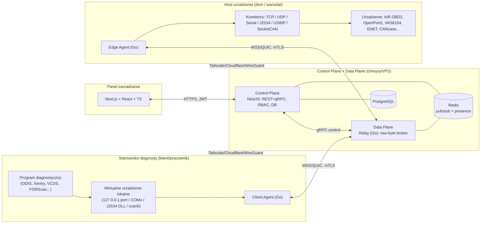

# Architektura docelowa (produkcyjna, enterprise)

Platforma: **transparentny most komunikacyjny** między oprogramowaniem diagnostycznym a
urządzeniem/pojazdem, przez Internet, niezależny od producenta.

---

## 1. Widok z lotu ptaka

**Zasada rozdziału:** **Control Plane** (kto, co wolno, rozliczenia, audyt) jest oddzielony od
**Data Plane** (przepływ surowych bajtów). Data Plane jest **bezstanowy i poziomo skalowalny**;
stan sesji żyje w Redis, trwałość w Postgres.

---

## 2. Komponenty

### 2.1 Edge Agent (host urządzenia) — Go, jeden binarny plik (Win/Linux/mac)
- Rejestruje się w platformie (device-code / token), publikuje listę **urządzeń** i ich **konektory**.
- Otwiera urządzenie lokalnie przez wybrany **konektor** i tuneluje strumień bajtów do Relay.
- Zarządza cyklem życia: keep-alive, reconnect z backoff, **resume token** (wznawianie sesji), 1‑klient/1‑urządzenie (konfigurowalne), limity.
- Zastępuje dzisiejsze `obd-ws.js` + `tcp-bridge.js` + skrypty, ale **reużywa sprawdzonej logiki relay** (TCP_NODELAY, brak kompresji, heartbeat).

### 2.2 Client Agent (stanowisko diagnosty) — Go
- Tworzy **wirtualne urządzenie lokalne** odpowiednie dla protokołu:
  - **TCP/UDP** → lokalny `127.0.0.1:port` (jak dziś),
  - **Serial** → wirtualny `COMx` (Windows: com0com/usbip; Linux: pty),
  - **J2534** → **shim DLL** rejestrowany w rejestrze PassThru, RPC do Edge,
  - **CAN** → wirtualny interfejs (`vcan`/socketcand).
- Łączy się z Relay, prezentuje program diagnostyczny **lokalnie** → „bez modyfikacji programu".

### 2.3 Relay (Data Plane) — Go
- Broker strumieni: paruje sesję `client ⇄ device` po `session_id`, przekazuje ramki binarne.
- Bezstanowy: routing i presence przez **Redis**; sticky przez `session_id`; **failover** = klient/edge re-łączą się do dowolnej instancji i wznawiają z resume tokenem.
- Mierzy: bajty↑↓, latencja RTT (ping aplikacyjny), zdarzenia → metryki Prometheus + zapis do Postgres (agregaty).

### 2.4 Control Plane — NestJS (Node + TypeScript)
- **REST API** (zarządzanie) + **gRPC** (sterowanie Relay/Agentami) + **WebSocket** (push do panelu).
- RBAC, MFA, JWT, wydawanie device-code/tokenów, licencje, audyt, webhooki.

### 2.5 Frontend — Next.js + React + TypeScript
- Dashboard (sesje/urządzenia/przepustowość/latencja/historia), zarządzanie użytkownikami/rolami,
  tryby A–D, generowanie linku/QR/kodu dla klienta, eksport CSV/PDF.

---

## 3. Macierz transportu = warstwa konektorów

Wspólny interfejs (patrz `platform/src/connectors/connector.ts`): każdy konektor to
dwukierunkowy strumień bajtów + metadane. Implementacje wg priorytetu (roadmapa):

| Konektor | Status w roadmapie | Klient (wirtualne urządzenie) |
|---|---|---|
| `tcp` (ELM327/ENET/DoIP/VAS6154-LAN/VXDIAG-net) | **M1 (reuse)** | lokalny port TCP |
| `udp` (+ DoIP discovery relay) | M2 | lokalny UDP |
| `serial` (COM) | M3 | wirtualny COMx / pty |
| `usbip` (dowolny dongle USB) | M4 | usbip client + sterowniki |
| `j2534` (PassThru shim) | M5 | shim DLL rejestrowany w PassThru |
| `socketcan`/`can-fd` | M6 | vcan / socketcand |

---

## 4. Tryby pracy (A–D) jako polityki

| Tryb | Tożsamość | Tunel domyślny | Zakres |
|---|---|---|---|
| **A Prywatny** | tylko właściciel (1 konto) | **Tailscale**, brak publicznego | własne urządzenia |
| **B Pracownik** | wielu userów, **role**, limity, **historia** | Cloudflare/own domain | przydzielone urządzenia/grupy |
| **C Klient** | jednorazowy **device-code + QR + link**, czas ważności | Cloudflare quick | jedno urządzenie/sesja, auto-zestawienie |
| **D Warsztat** | wiele stanowisk + wiele urządzeń, zarządzanie centralne | własny WireGuard/Tailnet | flota urządzeń, kolejkowanie |

Tryb jest atrybutem **organizacji/projektu**, egzekwowany w Control Plane (RBAC + polityki sesji).

---

## 5. Model danych (PostgreSQL) — skrót

Pełny DDL: `platform/db/schema.sql`. Główne tabele:

`tenants, users, roles, user_roles, memberships, api_keys, devices, agents,
sessions, session_events, audit_log, licenses, access_tokens, webhooks, webhook_deliveries`.

Kluczowe relacje: `tenant 1—* users/devices/sessions`; `session *—1 device`;
`session 1—* session_events`; `audit_log` append-only (hash-chain dla niezmienialności).

---

## 6. Bezpieczeństwo (wymogi spełnione przez design)

- **TLS 1.3** wszędzie; **mTLS** na kanale Agent⇄Relay (certy wydawane przez Control Plane, krótkie TTL, rotacja).
- **MFA** (TOTP) dla kont; **JWT** (krótki access + rotowany refresh); **RBAC** (role: owner/admin/manager/worker/client/viewer).
- **Audit Log** append-only z hash-chain; każda akcja: kto/co/kiedy/skąd.
- **IP Allow-List** per tenant/agent; **Rate Limiting** (Redis token-bucket) na API i na próby autoryzacji kanału danych.
- **Szyfrowanie danych**: w spoczynku (Postgres TDE/dysk + sekrety w KMS/Vault), w tranzycie (TLS/mTLS); sekrety nigdy w logach (zasada z v1 utrzymana).
- **Izolacja tenantów**: każde zapytanie filtrowane po `tenant_id` (row-level security w Postgres).

---

## 7. Monitoring i wydajność

- **Metryki**: Prometheus (sesje aktywne, urządzenia online, bajty/s, RTT, błędy) → **Grafana** + wbudowany dashboard.
- **Eksport CSV/PDF** raportów sesji/audytu (worker w kolejce).
- **SLO**: ≥100 jednoczesnych urządzeń, ≥1000 sesji/dobę. Skalowanie: Relay poziomo (N instancji za LB), Control Plane stateless za LB, Postgres z replikami read, Redis cluster.
- **Failover/recovery**: health-checki, automatyczny reconnect agentów (backoff+jitter), **resume token** wznawiający strumień bez utraty sesji logicznej; brak pojedynczego punktu awarii poza Postgres (HA przez replikę + failover).

---

## 8. Automatyzacja

- **REST API** (OpenAPI: `platform/openapi.yaml`) — pełne zarządzanie zasobami.
- **Webhooki** (HMAC-podpisane) na zdarzenia: `session.started/ended`, `device.online/offline`, `license.expiring`.
- **Integracje CRM/serwis**: konektory wychodzące (webhook → CRM) + import zleceń (REST).

---

## 9. Decyzja: Go + Node (hybryda) — uzasadnienie
Data-plane (Agent/Relay) w **Go**: jeden statyczny binarny agent na każdą platformę, świetna
obsługa tysięcy współbieżnych strumieni, niskie zużycie pamięci. Control-plane w **NestJS/TS**:
szybki development REST/RBAC/ORM, wspólny język z frontendem (Next.js/TS), bogaty ekosystem
(Passport/MFA, Prisma, BullMQ). Granica: gRPC między nimi. (Wariant „all-Go" możliwy — patrz ROADMAP D2.)
